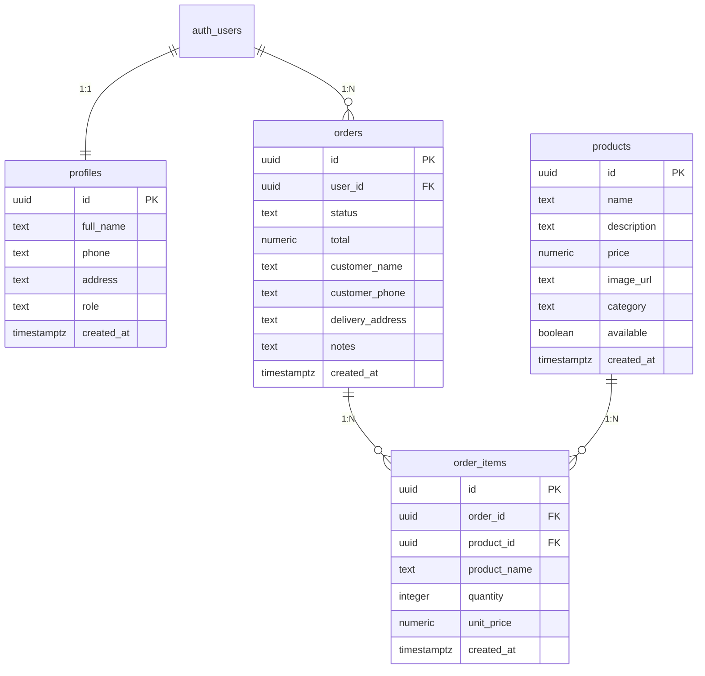

# Sweet Cupcake - Documentação do Projeto

Sistema web completo para confeitaria artesanal de cupcakes, desenvolvido em React + TypeScript + Tailwind CSS, com backend Supabase (PostgreSQL).

---

## 1. Requisitos Funcionais

### RF-01: Autenticação de Usuários
O sistema deve permitir que usuários criem contas com nome, e-mail, telefone e senha.
O sistema deve permitir login com e-mail e senha.
O sistema deve permitir recuperação de senha via envio de link por e-mail.
O sistema deve permitir logout.

### RF-02: Catálogo de Produtos
O sistema deve exibir uma página inicial com cupcakes em destaque.
O sistema deve exibir um catálogo completo de cupcakes com imagem, nome, descrição, preço e categoria.
O sistema deve permitir a busca de produtos por nome ou descrição.
O sistema deve permitir a filtragem de produtos por categoria.
O sistema deve permitir a ordenação de produtos por preço, nome ou mais recentes.

### RF-03: Carrinho de Compras
O sistema deve permitir adicionar produtos ao carrinho.
O sistema deve permitir alterar a quantidade de itens no carrinho.
O sistema deve permitir remover itens do carrinho.
O sistema deve exibir o subtotal e total do carrinho.
O sistema deve limpar o carrinho após a finalização do pedido.

### RF-04: Checkout e Pedidos
O sistema deve permitir que usuários autenticados finalize compras.
O sistema deve coletar dados de entrega (nome, telefone, endereço, observações).
O sistema deve criar o pedido e seus itens no banco de dados.
O sistema deve exibir uma confirmação após o pedido ser realizado.

### RF-05: Histórico de Pedidos
O sistema deve exibir o histórico de pedidos do usuário autenticado.
O sistema deve permitir expandir cada pedido para ver seus itens e detalhes.
O sistema deve exibir o status atual de cada pedido.

### RF-06: Perfil de Usuário
O sistema deve permitir que o usuário visualize e edite seu perfil.
O sistema deve permitir a atualização de nome, telefone e endereço.

### RF-07: Painel Administrativo
O sistema deve restringir o acesso ao painel administrativo a usuários com role "admin".
O sistema deve exibir estatísticas (receita total, total de pedidos, pedidos pendentes, produtos ativos).
O sistema deve permitir o gerenciamento completo de produtos (criar, editar, excluir).
O sistema deve permitir o gerenciamento de pedidos (visualizar e alterar status).
O sistema deve exibir pedidos recentes no painel.

---

## 2. Casos de Uso

### UC-01: Cadastrar Usuário
**Ator:** Visitante
**Fluxo principal:**
1. O visitante acessa a página de cadastro.
2. Preenche nome completo, e-mail, telefone e senha.
3. O sistema cria a conta e o perfil automaticamente.
4. O usuário é autenticado e redirecionado à página inicial.

**Fluxos alternativos:**
- E-mail já cadastrado: o sistema exibe mensagem de erro.

### UC-02: Fazer Login
**Ator:** Usuário cadastrado
**Fluxo principal:**
1. O usuário acessa a página de login.
2. Informa e-mail e senha.
3. O sistema autentica e redireciona à página inicial.

**Fluxos alternativos:**
- Credenciais inválidas: o sistema exibe mensagem de erro.

### UC-03: Recuperar Senha
**Ator:** Usuário cadastrado
**Fluxo principal:**
1. O usuário acessa a página de recuperação de senha.
2. Informa seu e-mail.
3. O sistema envia um link de redefinição por e-mail.
4. O sistema exibe confirmação de envio.

### UC-04: Buscar e Filtrar Produtos
**Ator:** Visitante / Usuário
**Fluxo principal:**
1. O usuário acessa o catálogo.
2. Digita um termo de busca ou seleciona uma categoria.
3. O sistema filtra os produtos em tempo real.

### UC-05: Adicionar Produto ao Carrinho
**Ator:** Visitante / Usuário
**Fluxo principal:**
1. O usuário clica no botão "+" em um produto.
2. O sistema adiciona o produto ao carrinho.
3. O contador do carrinho é atualizado.

### UC-06: Finalizar Compra (Checkout)
**Ator:** Usuário autenticado
**Pré-condição:** Carrinho não vazio e usuário logado.
**Fluxo principal:**
1. O usuário acessa o checkout a partir do carrinho.
2. Preenche/confirma dados de entrega.
3. O sistema cria o pedido e os itens no banco.
4. O carrinho é limpo e a confirmação é exibida.

**Fluxos alternativos:**
- Usuário não logado: redirecionado ao login.

### UC-07: Visualizar Histórico de Pedidos
**Ator:** Usuário autenticado
**Fluxo principal:**
1. O usuário acessa "Meus Pedidos".
2. O sistema exibe todos os pedidos do usuário.
3. O usuário expande um pedido para ver detalhes.

### UC-08: Gerenciar Produtos (Admin)
**Ator:** Administrador
**Fluxo principal:**
1. O admin acessa o painel > aba Produtos.
2. Pode criar, editar ou excluir produtos.
3. O sistema atualiza o catálogo em tempo real.

### UC-09: Gerenciar Pedidos (Admin)
**Ator:** Administrador
**Fluxo principal:**
1. O admin acessa o painel > aba Pedidos.
2. Visualiza todos os pedidos com dados do cliente.
3. Altera o status do pedido via menu suspenso.
4. O sistema atualiza o status no banco.

### UC-10: Visualizar Estatísticas (Admin)
**Ator:** Administrador
**Fluxo principal:**
1. O admin acessa o painel > aba Estatísticas.
2. O sistema exibe receita total, pedidos, pendentes e produtos ativos.
3. Exibe os pedidos mais recentes.

---

## 3. Diagrama de Classes

```
┌─────────────────────────┐
│       Profile           │
├─────────────────────────┤
│ - id: UUID              │
│ - full_name: String     │
│ - phone: String         │
│ - address: String       │
│ - role: Enum(admin,     │
│         cliente)        │
│ - created_at: DateTime  │
├─────────────────────────┤
│ + updateProfile()       │
│ + isAdmin(): Boolean    │
└─────────────────────────┘
          │ 1
          │
          │ *
┌─────────────────────────┐
│        Order            │
├─────────────────────────┤
│ - id: UUID              │
│ - user_id: UUID         │
│ - status: Enum(pendente,│
│   pago, preparando,     │
│   entregue, cancelado)  │
│ - total: Decimal        │
│ - customer_name: String │
│ - customer_phone: String│
│ - delivery_address:     │
│   String                │
│ - notes: String         │
│ - created_at: DateTime  │
├─────────────────────────┤
│ + create()              │
│ + updateStatus()        │
│ + calculateTotal()      │
└─────────────────────────┘
          │ 1
          │
          │ *
┌─────────────────────────┐     ┌─────────────────────────┐
│      OrderItem          │     │       Product           │
├─────────────────────────┤     ├─────────────────────────┤
│ - id: UUID              │     │ - id: UUID              │
│ - order_id: UUID        │     │ - name: String          │
│ - product_id: UUID      │◄───►│ - description: String   │
│ - product_name: String  │     │ - price: Decimal        │
│ - quantity: Integer     │     │ - image_url: String     │
│ - unit_price: Decimal   │     │ - category: String      │
│ - created_at: DateTime  │     │ - available: Boolean    │
├─────────────────────────┤     │ - created_at: DateTime  │
│ + getSubtotal(): Decimal│     ├─────────────────────────┤
└─────────────────────────┘     │ + create()              │
                                │ + update()              │
                                │ + delete()              │
                                │ + toggleAvailable()     │
                                └─────────────────────────┘

┌─────────────────────────┐
│      CartItem           │
├─────────────────────────┤  (Classe de frontend -
│ - product: ProductRef   │   não persistida no banco)
│ - quantity: Integer     │
├─────────────────────────┤
│ + getSubtotal(): Decimal│
└─────────────────────────┘
```

### Relacionamentos
- **Profile 1:N Order** — Um usuário pode ter vários pedidos.
- **Order 1:N OrderItem** — Um pedido contém vários itens.
- **OrderItem N:1 Product** — Cada item referencia um produto (product_id pode ser null se o produto for excluído).
- **CartItem** — Classe transitória do frontend que referencia produtos selecionados.

---

## 4. Modelo de Banco de Dados

### Visão Geral

O banco de dados utiliza PostgreSQL (via Supabase) com Row Level Security (RLS) habilitado em todas as tabelas.

### Tabelas

#### `profiles`
Estende a tabela `auth.users` do Supabase Auth.

| Coluna | Tipo | Constraints | Descrição |
|--------|------|-------------|-----------|
| id | UUID | PK, FK → auth.users(id) | Identificador do usuário |
| full_name | TEXT | NOT NULL DEFAULT '' | Nome completo |
| phone | TEXT | DEFAULT '' | Telefone |
| address | TEXT | DEFAULT '' | Endereço |
| role | TEXT | NOT NULL DEFAULT 'cliente', CHECK IN ('admin','cliente') | Papel do usuário |
| created_at | TIMESTAMPTZ | NOT NULL DEFAULT now() | Data de criação |

**RLS:**
- SELECT: próprio usuário OU admin
- INSERT: próprio usuário
- UPDATE: próprio usuário

#### `products`
Catálogo de cupcakes.

| Coluna | Tipo | Constraints | Descrição |
|--------|------|-------------|-----------|
| id | UUID | PK DEFAULT gen_random_uuid() | Identificador |
| name | TEXT | NOT NULL | Nome do produto |
| description | TEXT | DEFAULT '' | Descrição |
| price | NUMERIC(10,2) | NOT NULL, CHECK ≥ 0 | Preço |
| image_url | TEXT | DEFAULT '' | URL da imagem |
| category | TEXT | NOT NULL DEFAULT 'Classic' | Categoria |
| available | BOOLEAN | NOT NULL DEFAULT true | Disponibilidade |
| created_at | TIMESTAMPTZ | NOT NULL DEFAULT now() | Data de criação |

**RLS:**
- SELECT: público (anon + authenticated)
- INSERT/UPDATE/DELETE: apenas admin (via função `is_admin()`)

#### `orders`
Pedidos realizados.

| Coluna | Tipo | Constraints | Descrição |
|--------|------|-------------|-----------|
| id | UUID | PK DEFAULT gen_random_uuid() | Identificador |
| user_id | UUID | NOT NULL DEFAULT auth.uid(), FK → auth.users(id) | Dono do pedido |
| status | TEXT | NOT NULL DEFAULT 'pendente', CHECK IN (...) | Status do pedido |
| total | NUMERIC(10,2) | NOT NULL DEFAULT 0, CHECK ≥ 0 | Valor total |
| customer_name | TEXT | NOT NULL DEFAULT '' | Nome do cliente |
| customer_phone | TEXT | DEFAULT '' | Telefone |
| delivery_address | TEXT | NOT NULL DEFAULT '' | Endereço de entrega |
| notes | TEXT | DEFAULT '' | Observações |
| created_at | TIMESTAMPTZ | NOT NULL DEFAULT now() | Data do pedido |

**Status possíveis:** pendente, pago, preparando, entregue, cancelado.

**RLS:**
- SELECT: próprio usuário OU admin
- INSERT: próprio usuário (user_id = auth.uid())
- UPDATE: apenas admin
- DELETE: próprio usuário

#### `order_items`
Itens de cada pedido.

| Coluna | Tipo | Constraints | Descrição |
|--------|------|-------------|-----------|
| id | UUID | PK DEFAULT gen_random_uuid() | Identificador |
| order_id | UUID | NOT NULL, FK → orders(id) ON DELETE CASCADE | Pedido relacionado |
| product_id | UUID | FK → products(id) ON DELETE SET NULL | Produto (null se excluído) |
| product_name | TEXT | NOT NULL DEFAULT '' | Nome do produto (snapshot) |
| quantity | INTEGER | NOT NULL DEFAULT 1, CHECK > 0 | Quantidade |
| unit_price | NUMERIC(10,2) | NOT NULL DEFAULT 0, CHECK ≥ 0 | Preço unitário (snapshot) |
| created_at | TIMESTAMPTZ | NOT NULL DEFAULT now() | Data de criação |

**RLS:**
- SELECT: itens de pedidos do próprio usuário OU admin
- INSERT: itens de pedidos do próprio usuário

### Funções e Triggers

#### `is_admin()`
Função SECURITY DEFINER que retorna `true` se o usuário autenticado tem `role = 'admin'` em `raw_app_meta_data`. Usada nas policies de products, orders e order_items.

#### `handle_new_user()`
Trigger AFTER INSERT em `auth.users` que cria automaticamente um registro em `profiles` para cada novo usuário, copiando `full_name` e `role` dos metadados.

### Índices
- `idx_products_category` — busca por categoria
- `idx_orders_user_id` — pedidos por usuário
- `idx_orders_status` — filtragem por status
- `idx_order_items_order_id` — itens de um pedido
- `idx_profiles_role` — busca por role

### Diagrama ER (Mermaid)



---

## 5. Tecnologias Utilizadas

| Camada | Tecnologia |
|--------|-----------|
| Frontend | React 18 + TypeScript + Vite |
| Estilo | Tailwind CSS |
| Ícones | Lucide React |
| Backend/Database | Supabase (PostgreSQL) |
| Autenticação | Supabase Auth (e-mail/senha) |
| Segurança | Row Level Security (RLS) |

---

## 6. Estrutura do Projeto

```
src/
├── components/
│   ├── Navbar.tsx          # Barra de navegação
│   ├── Footer.tsx          # Rodapé
│   └── ProductCard.tsx     # Card de produto
├── context/
│   ├── AuthContext.tsx     # Contexto de autenticação
│   └── CartContext.tsx     # Contexto do carrinho
├── lib/
│   └── supabase.ts         # Cliente Supabase + tipos
├── pages/
│   ├── HomePage.tsx        # Página inicial
│   ├── LoginPage.tsx       # Login
│   ├── RegisterPage.tsx    # Cadastro
│   ├── RecoveryPage.tsx    # Recuperação de senha
│   ├── CatalogPage.tsx     # Catálogo com busca/filtros
│   ├── CartPage.tsx        # Carrinho de compras
│   ├── CheckoutPage.tsx    # Checkout
│   ├── OrdersPage.tsx      # Histórico de pedidos
│   ├── AdminPage.tsx       # Painel administrativo
│   └── ProfilePage.tsx     # Perfil do usuário
├── types/
│   └── index.ts            # Tipos compartilhados
├── App.tsx                 # Componente principal + roteamento
├── main.tsx                # Entry point
└── index.css               # Estilos globais + tema
```

---

## 7. Como Promover um Usuário a Administrador

Para conceder privilégios de administrador a um usuário, execute no SQL Editor do Supabase:

```sql
-- Substitua o e-mail pelo do usuário desejado
UPDATE auth.users
SET raw_app_meta_data = jsonb_set(
  COALESCE(raw_app_meta_data, '{}'::jsonb),
  '{role}',
  '"admin"'
)
WHERE email = 'admin@sweetcupcake.com.br';

-- Também atualiza o perfil
UPDATE public.profiles
SET role = 'admin'
WHERE id = (SELECT id FROM auth.users WHERE email = 'admin@sweetcupcake.com.br');
```

---

_Documentação gerada em setembro de 2026. Sweet Cupcake - Confeitaria Artesanal._
